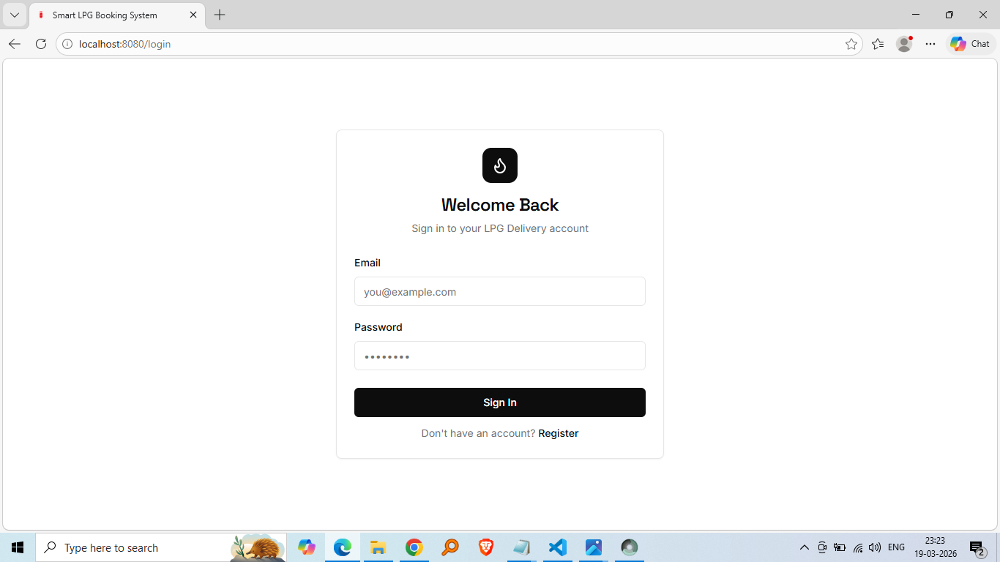
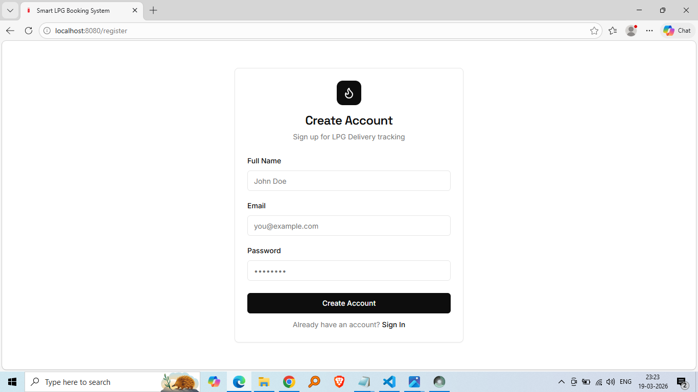
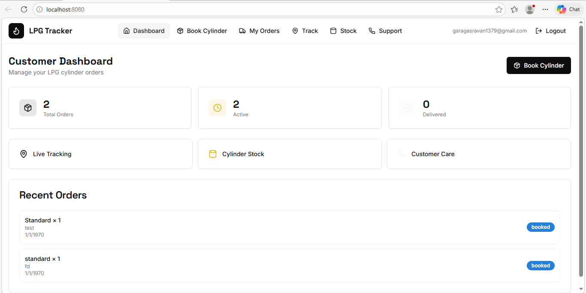
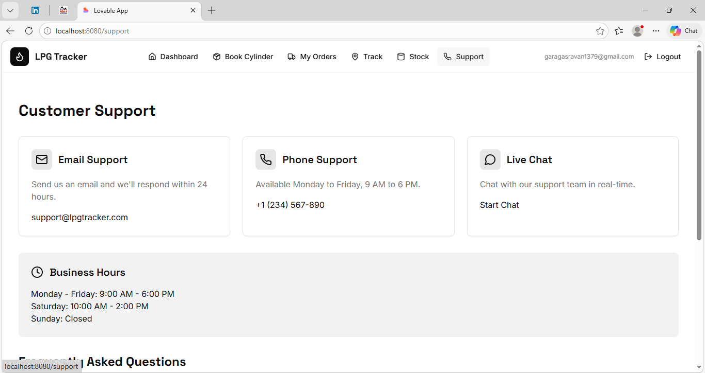

<div align="center">

<h1>Smart LPG Booking System</h1>

<p>A production-ready, full-stack web application for LPG cylinder booking, real-time delivery tracking, and multi-role fleet management — built with React 18, TypeScript, and Supabase.</p>

[](https://reactjs.org/)
[](https://www.typescriptlang.org/)
[](https://supabase.com/)
[](https://vitejs.dev/)
[](https://tailwindcss.com/)
[](LICENSE)

<br/>
<table>
  <tr>
    <td align="center" width="50%">
      <strong>🔐 Login</strong><br/><br/>
      
    </td>
    <td align="center" width="50%">
      <strong>📝 Register</strong><br/><br/>
      
    </td>
  </tr>
  <tr>
    <td align="center" width="50%">
      <strong>📊 Dashboard</strong><br/><br/>
      
    </td>
    <td align="center" width="50%">
      <strong>💬 Customer-Support</strong><br/><br/>
      
    </td>
  </tr>
</table>


<br/>

</div>

---

<br/>


## 🔥 About the Project
<!-- ═══════════════════════════════════════════════════════════ -->

**The problem:** In India, LPG cylinder booking still relies on phone calls, manual registers, and zero delivery visibility. Customers don't know when their cylinder will arrive. Dealers have no digital dispatch system.

**The solution:** A modern, real-time web platform that digitizes the entire LPG supply chain — from online booking to GPS-ready delivery tracking — for three stakeholders: customers, delivery agents, and admins.

```
Customer books online → Agent gets assigned → Agent updates status → Customer sees it live
```

<!-- ═══════════════════════════════════════════════════════════ -->
## ✨ Features
<!-- ═══════════════════════════════════════════════════════════ -->
Digitizes the LPG cylinder supply chain — customers book online, agents manage deliveries, orders sync in real time via WebSocket subscriptions.

Three roles: **Customer** · **Delivery Agent** · **Admin**

## Features

**Customer**
- Book cylinders (Standard 14.2kg / Small 5kg / Commercial 19kg)
- Live delivery tracking with agent details and ETA
- Full order history with real-time status updates
- Cylinder stock availability dashboard

**Delivery Agent**
- View assigned orders
- One-tap status updates: `Assigned → Out for Delivery → Delivered`

**Platform**
- JWT auth with email verification
- Role-based protected routes
- Dark / Light mode
- Fully responsive

---
<br/>

<!-- ═══════════════════════════════════════════════════════════ -->
## 🛠 Tech Stack
<!-- ═══════════════════════════════════════════════════════════ -->

## Tech Stack

| Layer | Technologies |
|-------|-------------|
| Frontend | React 18, TypeScript, Vite, Tailwind CSS, shadcn/ui |
| State | TanStack Query, Zustand |
| Forms | React Hook Form, Zod |
| Backend | Supabase (PostgreSQL, Auth, Realtime, Edge Functions) |
| AI | Supabase Edge Function (Deno) + Gemini 3 Flash |
| Testing | Vitest, Testing Library |

---
<!-- ═══════════════════════════════════════════════════════════ -->
## 🏗 System Architecture
<!-- ═══════════════════════════════════════════════════════════ -->

```
Browser (React App)
        │
        │ React Router + TanStack Query
        │
        ▼
Supabase Client SDK
        │
        ▼
Supabase Backend
        │
 ┌──────────────┬───────────────┬──────────────┐
 │ Auth Service │ PostgreSQL DB │ Realtime API │
 └──────────────┴───────────────┴──────────────┘
```

---


<!-- ═══════════════════════════════════════════════════════════ -->
## 🗄 Database Design
<!-- ═══════════════════════════════════════════════════════════ -->

Main tables used in the system:

```
profiles
user_roles
orders
agent_locations
```

### Order Status Flow

```
booked → assigned → out_for_delivery → delivered
```

Row Level Security policies ensure that:

• Customers only see their own orders
• Agents only access assigned deliveries
• Admins can access all system data

---


<!-- ═══════════════════════════════════════════════════════════ -->
## 📁 Project Structure
<!-- ═══════════════════════════════════════════════════════════ -->

```
smart-lpg-booking-system

public
 ├── lpg-icon.png
 └── robots.txt

src
 ├── components
 │   ├── layout
 │   │   └── AppLayout.tsx
 │   └── ui
 │       ├── button.tsx
 │       ├── card.tsx
 │       ├── badge.tsx
 │       ├── dialog.tsx
 │       └── other UI components
 │
 ├── hooks
 │   └── useAuth.tsx
 │
 ├── integrations
 │   └── supabase
 │       ├── client.ts
 │       └── types.ts
 │
 ├── lib
 │   └── utils.ts
 │
 ├── pages
 │   ├── Login.tsx
 │   ├── Register.tsx
 │   ├── CustomerDashboard.tsx
 │   ├── AgentDashboard.tsx
 │   ├── BookCylinder.tsx
 │   ├── CustomerOrders.tsx
 │   ├── TrackOrder.tsx
 │   ├── CylinderStock.tsx
 │   ├── Support.tsx
 │   └── NotFound.tsx
 │
 ├── App.tsx
 ├── main.tsx
 └── index.css

supabase
 ├── functions
 │   └── ai-insights
 │       └── index.ts
 └── migrations

package.json
vite.config.ts
tailwind.config.ts
tsconfig.json
postcss.config.js
eslint.config.js
```


<!-- ═══════════════════════════════════════════════════════════ -->
## 🚀 Getting Started
<!-- ═══════════════════════════════════════════════════════════ -->

## Prerequisites

Node.js ≥ 18
Supabase account

## Installation

Clone the repository

```
git clone https://github.com/YOUR_USERNAME/smart-lpg-booking-system.git
cd smart-lpg-booking-system
```

Install dependencies

```
npm install
```

Create environment file

```
cp .env.example .env
```

Run development server

```
npm run dev
```

Application will run at:

```
http://localhost:5173
```

---

<!-- ═══════════════════════════════════════════════════════════ -->
## 🔐 Environment Variables
<!-- ═══════════════════════════════════════════════════════════ -->

Create a `.env` file and add:

```
VITE_SUPABASE_URL=https://your-project-id.supabase.co
VITE_SUPABASE_ANON_KEY=your_supabase_anon_key
```

These values can be obtained from:

Supabase Dashboard → Project Settings → API

---


<!-- ═══════════════════════════════════════════════════════════ -->
## 🌐 Deployment
<!-- ═══════════════════════════════════════════════════════════ -->

# Deployment

The application can be deployed using:

Vercel
Netlify
Render

### Netlify

```bash
npm run build
# Drag and drop the dist/ folder at: netlify.com/drop
# Or: netlify deploy --prod --dir=dist
```
<br/>

<!-- ═══════════════════════════════════════════════════════════ -->
## 🗺 Roadmap
<!-- ═══════════════════════════════════════════════════════════ -->

- [ ] Admin dashboard with analytics
- [ ] Real GPS tracking (agent_locations table is ready)
- [ ] Push notifications
- [ ] PWA / offline support
- [ ] Multi-language support (Hindi, Telugu, Tamil)


<br/>


# Skills Demonstrated

React
TypeScript
Supabase
PostgreSQL
Real-time Systems
Role Based Access Control
Responsive UI Development

---

# Author

**Revanth Garaga**

Full Stack Developer

GitHub
https://github.com/revanthgaraga7

---

# License

This project is licensed under the **MIT License**.

---

⭐ If you found this project useful, consider giving it a star.
